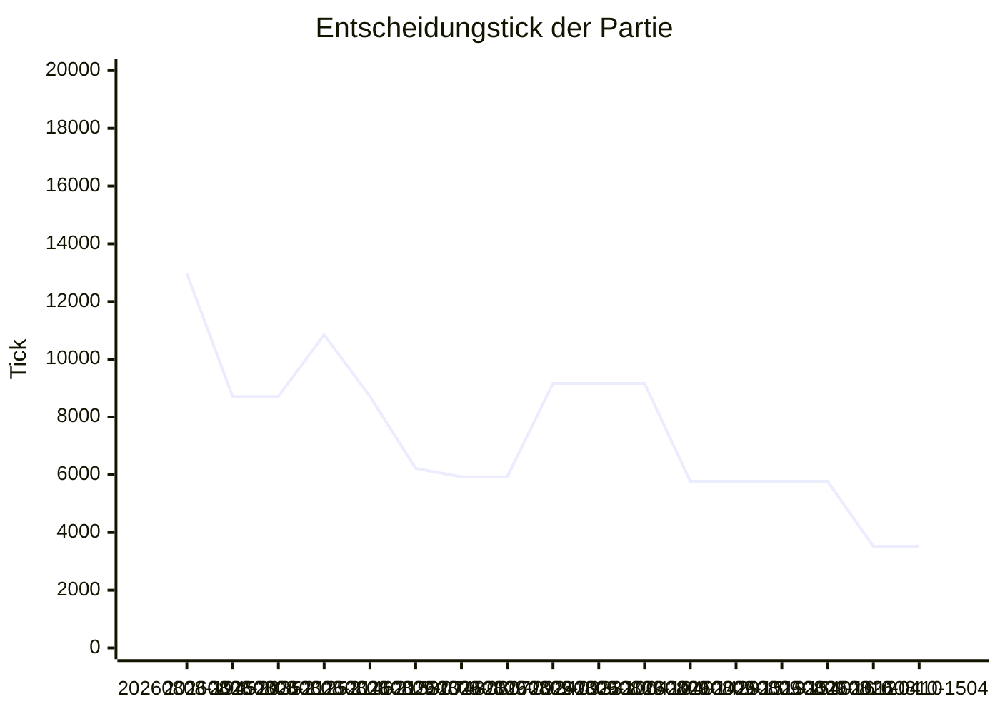
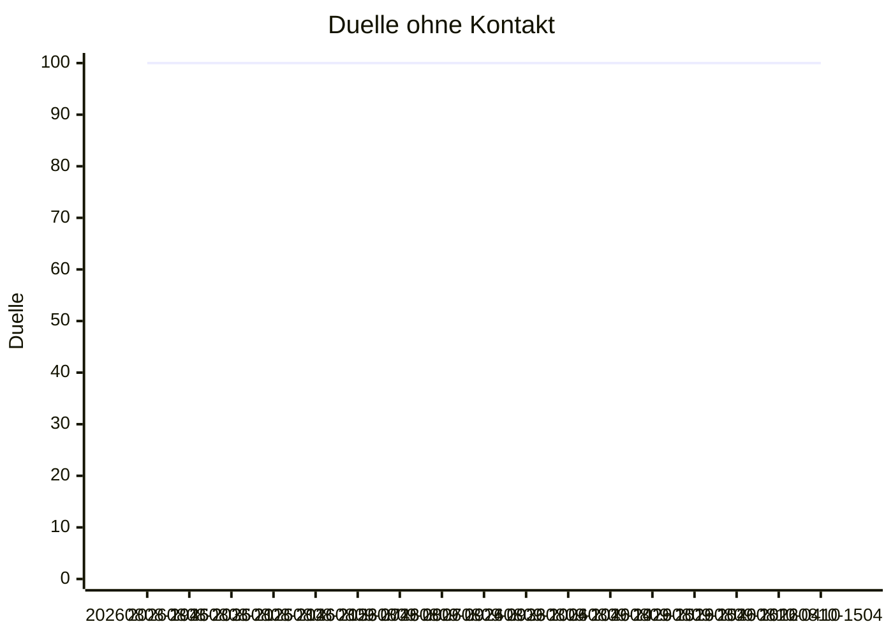
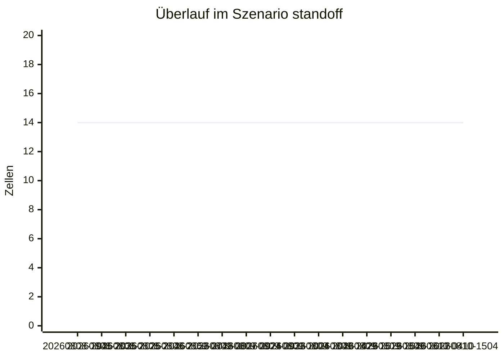

# Nova.AiLab — Berichte

> [!IMPORTANT]
> **DIAGNOSE, kein Nachweis.** Nichts in diesem Bericht wurde im laufenden Spiel gesehen.
> Alle Zahlen stammen aus headless-Läufen derselben Quelldateien, die Unity lädt — das
> macht sie vergleichbar, nicht wahr. Es gibt bewusst **keine Rangfolge**: die Werte stehen
> nebeneinander, die Auswahl trifft ein Mensch.

↩ zurück zum [Labor](../README.md) · [Handreichung für Agenten](../AGENTS.md)

Dieser Ordner ist die **lesbare Fassung** der Laborläufe: [`latest.md`](latest.md) ist immer der zuletzt vermessene Lauf, `runs/` die Historie, `data/` die verdichteten Messwerte, aus denen beides jederzeit neu entsteht. Die interaktive Fassung mit Kurven, Heatmap und Scrubber bleibt [`../out/dashboard.html`](../out/dashboard.html) — sie braucht einen Browser, dieser Ordner nicht.

> [!IMPORTANT]
> **Was hier NICHT generiert wird: [`behavior-log.md`](behavior-log.md).** Die Berichte sagen, wo die Zahlen stehen — das Journal sagt, *warum* sie sich bewegt haben: je Verhaltensänderung die genauen Werte, die Folgen in beide Richtungen und ein Abschnitt „Widerlegt". Vor einer neuen Idee zuerst dort nachsehen; eine Sackgasse, die niemand aufgeschrieben hat, wird ein zweites Mal gelaufen.

```bash
# messen, Bericht schreiben, Historie fortschreiben — ein Kommando
python3 tools/Nova.AiLab/report/build_reports.py tools/Nova.AiLab/out

# nur neu rendern, ohne zu messen (nach einer Formatänderung)
python3 tools/Nova.AiLab/report/build_reports.py --regenerate
```

## Zuletzt vermessen — [`20260810-1504-c8e46af5`](latest.md)

| Was | Wert |
| --- | --: |
| gemessen am | 2026-08-10T15:04:53Z |
| Commit | `c8e46af5` |
| Definitionstabelle | `0x6326FA3E56CFF5A3` |
| KI-Verhalten | `r6.E34435F9` |
| Partie entschieden bei Tick | 3.520 — Slot 0 |
| Duelle entschieden | 395 von 576, 100 ohne Kontakt |
| Überlauf `standoff` | 14 von 14 nutzbaren Zellen |
| Endzustands-Hash | `0x362A149F1A637FCD` |

## Historie — 17 Läufe

| Lauf | gemessen (UTC) | Commit | Sieger | entsch. Tick | Duelle entsch. | ohne Kontakt | wackelnd | Überlauf standoff | angekommen | Endzustands-Hash |
| --- | --- | --- | --- | --: | --: | --: | --: | --: | --: | --- |
| [`20260810-1504-c8e46af5`](runs/20260810-1504-c8e46af5.md) | 2026-08-10 15:04 | `c8e46af5` | Slot 0 | 3.520 | 395/576 | 100 | 6 | 14/14 | 64/64 | `0x362A149F1A637FCD` |
| [`20260810-0410-c8e46af5`](runs/20260810-0410-c8e46af5.md) | 2026-08-10 04:10 | `c8e46af5` | Slot 0 | 3.520 | 395/576 | 100 | 6 | 14/14 | 64/64 | `0x362A149F1A637FCD` |
| [`20260809-1612-308d8cf0`](runs/20260809-1612-308d8cf0.md) | 2026-08-09 16:12 | `308d8cf0` | Slot 0 | 5.773 | 395/576 | 100 | 6 | 14/14 | 64/64 | `0x2B34B4E194257940` |
| [`20260809-1540-c0fc1b09`](runs/20260809-1540-c0fc1b09.md) | 2026-08-09 15:40 | `c0fc1b09` | Slot 0 | 5.773 | 395/576 | 100 | 6 | 14/14 | 64/64 | `0x2B34B4E194257940` |
| [`20260809-1519-f13f4d5f`](runs/20260809-1519-f13f4d5f.md) | 2026-08-09 15:19 | `f13f4d5f` | Slot 0 | 5.773 | 395/576 | 100 | 6 | 14/14 | 64/64 | `0x2B34B4E194257940` |
| [`20260809-1429-3d28f24f`](runs/20260809-1429-3d28f24f.md) | 2026-08-09 14:29 | `3d28f24f` | Slot 0 | 5.773 | 395/576 | 100 | 6 | 14/14 | 64/64 | `0x2B34B4E194257940` |
| [`20260809-1040-97a9e5b1`](runs/20260809-1040-97a9e5b1.md) ⚠ | 2026-08-09 10:40 | `97a9e5b1` | Slot 0 | 9.164 | 395/576 | 100 | 6 | 14/14 | 64/64 | `0x8054A759F73E1F81` |
| [`20260809-1004-a7678969`](runs/20260809-1004-a7678969.md) ⚠ | 2026-08-09 10:04 | `a7678969` | Slot 0 | 9.164 | 395/576 | 100 | 6 | 14/14 | 64/64 | `0x8054A759F73E1F81` |
| [`20260809-0933-9c2817fe`](runs/20260809-0933-9c2817fe.md) ⚠ | 2026-08-09 09:33 | `9c2817fe` | Slot 0 | 9.164 | 395/576 | 100 | 6 | 14/14 | 64/64 | `0x8054A759F73E1F81` |
| [`20260809-0924-8fe6fece`](runs/20260809-0924-8fe6fece.md) ⚠ | 2026-08-09 09:24 | `8fe6fece` | Slot 0 | 5.931 | 395/576 | 100 | 6 | 14/14 | 64/64 | `0x8E054C63DE80BDD6` |
| [`20260809-0807-3f7f5811`](runs/20260809-0807-3f7f5811.md) ⚠ | 2026-08-09 08:07 | `3f7f5811` | Slot 0 | 5.931 | 395/576 | 100 | 6 | 14/14 | 64/64 | `0x8E054C63DE80BDD6` |
| [`20260809-0748-0b0c211c`](runs/20260809-0748-0b0c211c.md) ⚠ | 2026-08-09 07:48 | `0b0c211c` | Slot 0 | 6.223 | 395/576 | 100 | 6 | 14/14 | 64/64 | `0x5243FDAD54967102` |
| [`20260808-2153-206d8bc5`](runs/20260808-2153-206d8bc5.md) ⚠ | 2026-08-08 21:53 | `206d8bc5` | Slot 0 | 8.715 | 395/576 | 100 | 6 | 14/14 | 64/64 | `0x5D8FB2D45FFD16B6` |
| [`20260808-2146-206d8bc5`](runs/20260808-2146-206d8bc5.md) ⚠ | 2026-08-08 21:46 | `206d8bc5` | Slot 0 | 10.847 | 395/576 | 100 | 6 | 14/14 | 64/64 | `0xE29561FBA5A257F1` |
| [`20260808-2125-7ac3015a`](runs/20260808-2125-7ac3015a.md) ⚠ | 2026-08-08 21:25 | `7ac3015a` | Slot 0 | 8.715 | 395/576 | 100 | 6 | 14/14 | 64/64 | `0x5D8FB2D45FFD16B6` |
| [`20260808-2035-ab6cb9a1`](runs/20260808-2035-ab6cb9a1.md) ⚠ | 2026-08-08 20:35 | `ab6cb9a1` | Slot 0 | 8.715 | 395/576 | 100 | 6 | 14/14 | 64/64 | `0x5D8FB2D45FFD16B6` |
| [`20260808-1945-3b3f27d7`](runs/20260808-1945-3b3f27d7.md) ⚠ | 2026-08-08 19:45 | `3b3f27d7` | Slot 0 | 12.975 | 395/576 | 100 | 6 | 14/14 | 64/64 | `0x4947D4769384585C` |

> [!WARNING]
> **⚠ — 11 von 17 Läufen sind mit einem defekten Messgerät gemessen** (Laborstand vor `cf49bd7`, `reportSchemaVersion 1`: halbierte Reaktionszählung, falsch beschriftetes Duellbudget, fehlendes `decidedMatches`). Ihre Zeilen stehen hier, weil sie gelaufen sind — ihre Zahlen tragen nichts. Sie lassen sich weder neu rendern noch nachmessen: `data/` ist bereits das Ergebnis des defekten Geräts, und das heutige Labor baut gegen jene Commits nicht mehr. Die Begründung im Einzelnen steht in jedem der betroffenen Berichte.
> Belastbar sind die 6 Läufe ohne ⚠ — ab [`20260809-1429-3d28f24f`](runs/20260809-1429-3d28f24f.md).

**Entscheidungstick der Partie** — je Lauf, ältester links



**Duelle ohne Kontakt** — je Lauf, ältester links



**Überlauf im Szenario standoff** — je Lauf, ältester links



---

Ein grüner Laborlauf ist Diagnose, kein Nachweis. Was nicht im laufenden Spiel gesehen wurde, steht als ungesehen im PR-Text — diese Seite ersetzt keine gespielte Beobachtung.
