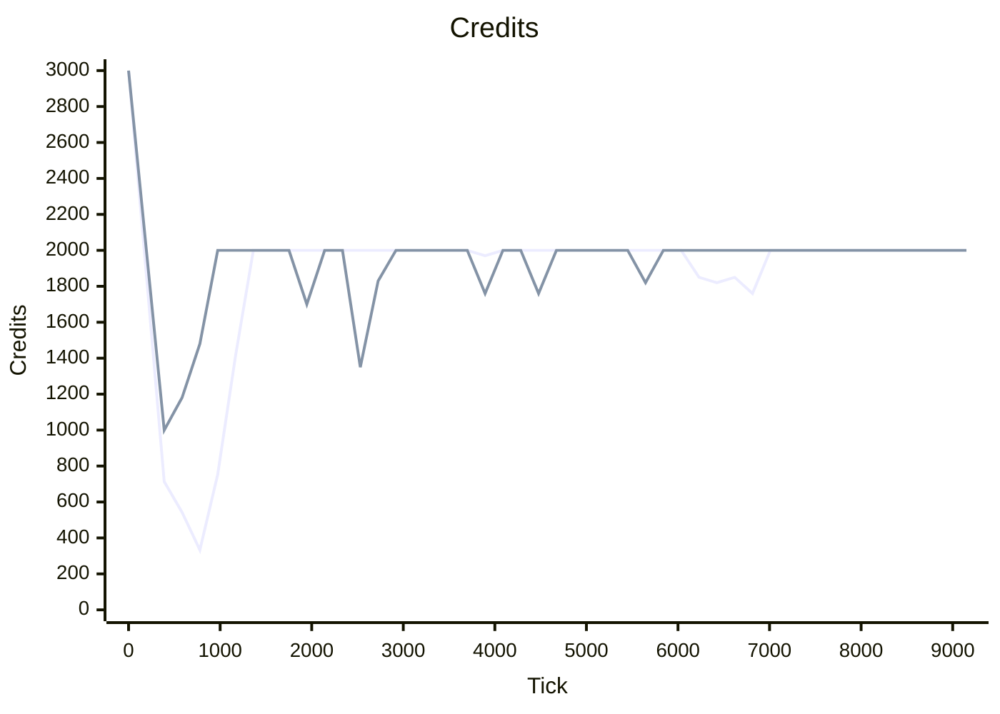
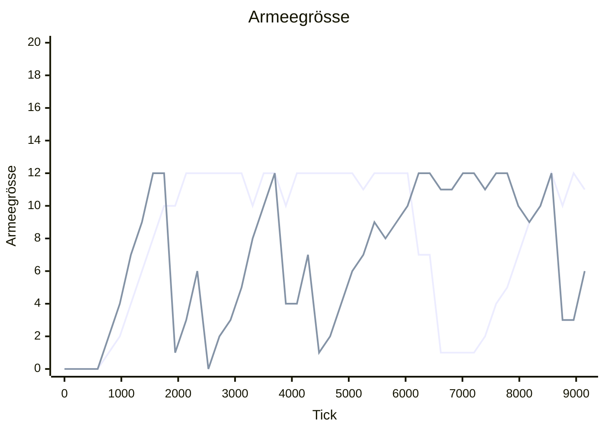
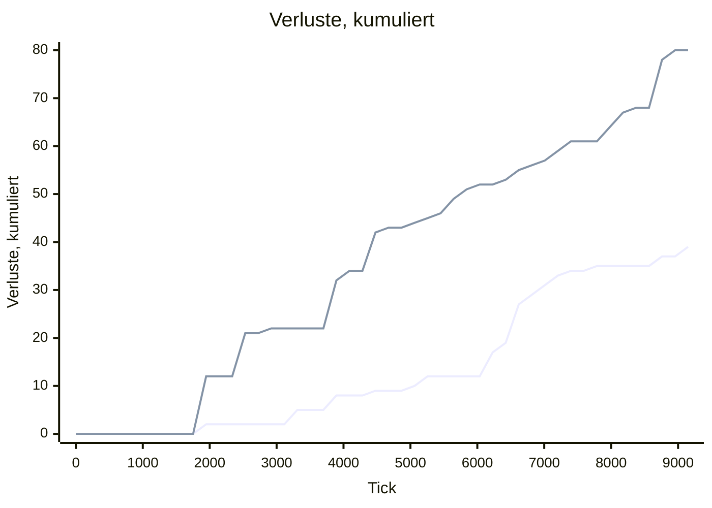
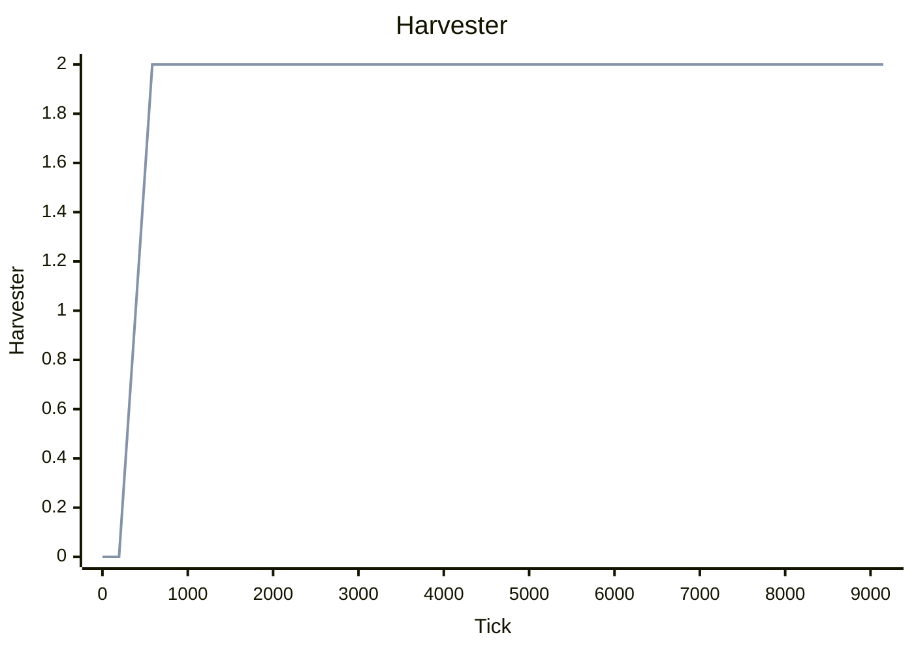

# Laborlauf 20260813-1852-4825d3e0

> [!IMPORTANT]
> **DIAGNOSE, kein Nachweis.** Nichts in diesem Bericht wurde im laufenden Spiel gesehen.
> Alle Zahlen stammen aus headless-Läufen derselben Quelldateien, die Unity lädt — das
> macht sie vergleichbar, nicht wahr. Es gibt bewusst **keine Rangfolge**: die Werte stehen
> nebeneinander, die Auswahl trifft ein Mensch.

| Herkunft | Wert |
| --- | --: |
| gemessen am | 2026-08-13T18:52:17Z |
| Commit | `4825d3e0b015221abacea0eb6d511a35dd8d1549` |
| Definitionstabelle | `0xD5F219A3F68088FF` |
| KI-Verhalten | `r11.CA58924C` |
| Messgerät | `Schema 2` |
| Seed | `0xA17E57DE57` |
| Tickbudget | 27.000 |
| Slots | 2 |
| specVersion | 1 |
| Fingerabdruck | `7b8d70cc71281f16` |

Interaktive Fassung derselben Zahlen: [`dashboard.html`](../../out/dashboard.html) — Kurven mit Fadenkreuz, Heatmap mit Abstandsdetail, Scrubber. Lokal öffnen, kein Server nötig; GitHub zeigt HTML nicht an, dafür ist dieser Bericht da.

## Laufart 1 · `match` — die Partie: KI gegen KI

Eine kanonische Partie über beide Slots, Metriken alle 50 Ticks, reine Beobachtung — ein Lauf mit und ohne Trace liefert dieselbe Hash-Kette.

| Kennzahl | Wert | Kontext |
| --- | --: | --- |
| Ausgang | VictoryElimination | Slot 0 · alliance |
| Entschieden bei Tick | 9.173 | von 27.000 Budget |
| Rechenzeit | 1.484 ms | 6.181 Ticks/s |
| Metrikproben | 184 | alle 50 Ticks |
| Hash-Kette | 19 | alle 500 Ticks |
| Endzustands-Hash | `0xACCAC85186946AFE` | bei Tick 9.173 |

| Endwert je Slot | Slot 0 · alliance | Slot 1 · legion |
| --- | --: | --: |
| Credits | 2.000 | 2.000 |
| Armeegrösse | 11 | 6 |
| Verluste, kumuliert | 39 | 80 |
| Harvester | 2 | 2 |
| Gebäude | 4 | 4 |
| Sichtbare Feindeinheiten | 9 | 4 |

1. Linie **Slot 0 · alliance** · 2. Linie **Slot 1 · legion**. `xychart-beta` kennt keine Legende, deshalb steht die Zuordnung hier. x-Achse Tick 0 bis 9.150, alle Werte ganzzahlig — kein Float verlässt die Simulation.

**Credits** — Kassenstand je Slot



**Armeegrösse** — lebende Kampfeinheiten



**Verluste, kumuliert** — verlorene Einheiten seit Tick 0



**Harvester** — Erntefahrzeuge im Feld



**Verworfene Intents:** 0 von 553 (Slot 0) und 0 von 417 (Slot 1). Diese Spalte ist die unterschätzte — sie zeigt, wo die KI gegen Executor-Regeln anrennt, und ist überall sonst stumm, weil `Submit()` das Verdikt nicht auswertet.

**Der Seed ändert die Partie nicht.** Kein Simulationssystem zieht aus dem Kernel-PRNG; der Seed geht in Zustands-Hash und Snapshot, sonst nirgendwohin. Ein Sweep über 24 Seeds ist *eine* Beobachtung.

## Laufart 4 · `compare` — Kandidatenprofile gegen die eingefrorene Referenz

Jeder Kandidat spielt gegen `ms1-canonical`, in beiden Fraktionsrollen — das hebt die Spawnreihenfolge auf. Die Zeilenreihenfolge ist die Kandidatenliste, nicht die Güte.

| Kandidat | geändert gegen Referenz | Sieg % | S/N/U | Entsch. Tick | Credits | Armee | verloren | Intents | verworfen |
| --- | --- | --: | --: | --: | --: | --: | --: | --: | --: |
| **ms1-canonical** _Referenz_ | — | 50 % | 1/1/0 | 9.173 | 2.000 | 8 | 57 | 956 | 0 |
| **early-push** | armySize 12→10; squadThreshold 6→3 | 50 % | 1/1/0 | 8.138 (-11 %) | 1.880 (-6 %) | 5 (-38 %) | 53 (-7 %) | 846 | 0 |
| **late-push** | armySize 12→20; squadThreshold 6→12 | 100 % | 2/0/0 | 11.098 (+21 %) | 2.000 | 19 (+138 %) | 90 (+58 %) | 1.209 | 0 |
| **greedy-economy** | harvesters 2→4; armySize 12→16; squadThreshold 6→8 | 50 % | 1/1/0 | 8.252 (-10 %) | 2.000 | 9 (+12 %) | 62 (+9 %) | 1.015 | 0 |
| **power-buffer** | powerReserve 0→30 | 50 % | 1/1/0 | 11.745 (+28 %) | 1.880 (-6 %) | 8 | 93 (+63 %) | 1.043 | 0 |
| **fast-cadence** | cadence 20→10 | 50 % | 1/1/0 | 9.677 (+5 %) | 1.760 (-12 %) | 6 (-25 %) | 49 (-14 %) | 1.571 | 0 |
| **wave-off** | waveSize 12→1 | 0 % | 0/1/1 | 18.493 (+102 %) | 1.970 (-2 %) | 8 | 145 (+154 %) | 2.947 | 0 |
| **wave-6** | waveSize 12→6 | 50 % | 1/1/0 | 9.173 | 2.000 | 8 | 57 | 956 | 0 |
| **wave-10** | waveSize 12→10 | 50 % | 1/1/0 | 9.173 | 2.000 | 8 | 57 | 956 | 0 |
| **wave-6-far** | waveSize 12→6; staging 12→70; stagingTol 4→6 | 50 % | 1/1/0 | 7.009 (-24 %) | 2.000 | 8 | 49 (-14 %) | 717 | 0 |
| **retreat-off** | retreatAt 60→0% | 50 % | 1/1/0 | 6.749 (-26 %) | 1.970 (-2 %) | 6 (-25 %) | 51 (-11 %) | 465 | 0 |
| **retreat-40** | retreatAt 60→40% | 50 % | 1/1/0 | 7.011 (-24 %) | 1.940 (-3 %) | 6 (-25 %) | 55 (-4 %) | 528 | 0 |
| **retreat-75** | retreatAt 60→75% | 50 % | 1/1/0 | 9.765 (+6 %) | 2.000 | 8 | 59 (+4 %) | 1.028 | 0 |
| **retreat-25-near** | retreatAt 60→25%; retreatDanger 8→4 | 50 % | 1/1/0 | 7.370 (-20 %) | 2.000 | 5 (-38 %) | 59 (+4 %) | 584 | 0 |
| **army-16** | armySize 12→16 | 50 % | 1/1/0 | 7.801 (-15 %) | 2.000 | 9 (+12 %) | 57 | 893 | 0 |
| **army-18** | armySize 12→18 | 100 % | 2/0/0 | 11.150 (+22 %) | 2.000 | 14 (+75 %) | 89 (+56 %) | 1.329 | 0 |
| **army-20** | armySize 12→20 | 100 % | 2/0/0 | 6.607 (-28 %) | 1.940 (-3 %) | 14 (+75 %) | 47 (-18 %) | 885 | 0 |
| **army-24** | armySize 12→24 | 100 % | 2/0/0 | 8.146 (-11 %) | 2.000 | 23 (+188 %) | 60 (+5 %) | 1.108 | 0 |
| **army-36** | armySize 12→36 | 100 % | 2/0/0 | 9.721 (+6 %) | 1.940 (-3 %) | 25 (+212 %) | 82 (+44 %) | 1.520 | 0 |
| **strength-off** | waveStrength 1200→0 | 50 % | 1/1/0 | 9.173 | 2.000 | 8 | 57 | 956 | 0 |
| **defend-off** | defendHome 10→0 | 50 % | 1/1/0 | 7.201 (-21 %) | 1.925 (-4 %) | 4 (-50 %) | 43 (-25 %) | 752 | 0 |
| **defend-8** | defendHome 10→8 | 50 % | 1/1/0 | 9.173 | 2.000 | 8 | 57 | 956 | 0 |
| **defend-16** | defendHome 10→16 | 50 % | 1/1/0 | 8.874 (-3 %) | 1.760 (-12 %) | 6 (-25 %) | 68 (+19 %) | 838 | 0 |
| **army-24-count** | armySize 12→24; waveStrength 1200→0 | 50 % | 1/1/0 | 5.230 (-43 %) | 2.000 | 14 (+75 %) | 34 (-40 %) | 787 | 0 |
| **army-36-count** | armySize 12→36; waveStrength 1200→0 | 50 % | 1/1/0 | 5.133 (-44 %) | 2.000 | 15 (+88 %) | 34 (-40 %) | 855 | 0 |
| **army-16-count** | armySize 12→16; waveStrength 1200→0 | 50 % | 1/1/0 | 4.455 (-51 %) | 2.000 | 10 (+25 %) | 30 (-47 %) | 440 | 0 |
| **army-30-count** | armySize 12→30; waveStrength 1200→0 | 50 % | 1/1/0 | 5.133 (-44 %) | 2.000 | 15 (+88 %) | 34 (-40 %) | 812 | 0 |
| **army-19** | armySize 12→19 | 50 % | 1/1/0 | 9.767 (+6 %) | 2.000 | 11 (+38 %) | 81 (+42 %) | 1.225 | 0 |
| **army-21** | armySize 12→21 | 100 % | 2/0/0 | 7.802 (-15 %) | 2.000 | 19 (+138 %) | 55 (-4 %) | 962 | 0 |
| **army-22** | armySize 12→22 | 100 % | 2/0/0 | 8.035 (-12 %) | 1.940 (-3 %) | 18 (+125 %) | 59 (+4 %) | 1.072 | 0 |
| **army-28** | armySize 12→28 | 100 % | 2/0/0 | 8.672 (-5 %) | 1.940 (-3 %) | 26 (+225 %) | 64 (+12 %) | 1.176 | 0 |
| **army-30** | armySize 12→30 | 100 % | 2/0/0 | 6.471 (-29 %) | 1.910 (-4 %) | 24 (+200 %) | 40 (-30 %) | 930 | 0 |
| **army-32** | armySize 12→32 | 100 % | 2/0/0 | 6.478 (-29 %) | 1.910 (-4 %) | 27 (+238 %) | 37 (-35 %) | 977 | 0 |
| **army-34** | armySize 12→34 | 100 % | 2/0/0 | 9.619 (+5 %) | 2.000 | 29 (+262 %) | 75 (+32 %) | 1.401 | 0 |
| **army-40** | armySize 12→40 | 100 % | 2/0/0 | 7.223 (-21 %) | 1.940 (-3 %) | 28 (+250 %) | 48 (-16 %) | 1.165 | 0 |
| **army-48** | armySize 12→48 | 100 % | 2/0/0 | 7.223 (-21 %) | 2.000 | 28 (+250 %) | 48 (-16 %) | 1.205 | 0 |
| **reinforce-20** | reinforceAt 0→20% | 50 % | 1/1/0 | 7.489 (-18 %) | 2.000 | 7 (-12 %) | 49 (-14 %) | 690 | 0 |
| **reinforce-50** | reinforceAt 0→50% | 50 % | 1/1/0 | 6.472 (-29 %) | 2.000 | 7 (-12 %) | 36 (-37 %) | 562 | 0 |
| **reinforce-70** | reinforceAt 0→70% | 50 % | 1/1/0 | 8.484 (-8 %) | 2.000 | 7 (-12 %) | 45 (-21 %) | 667 | 0 |
| **reinforce-40** | reinforceAt 0→40% | 50 % | 1/1/0 | 10.162 (+11 %) | 1.880 (-6 %) | 5 (-38 %) | 56 (-2 %) | 861 | 0 |
| **reinforce-25** | reinforceAt 0→25% | 50 % | 1/1/0 | 7.779 (-15 %) | 1.940 (-3 %) | 6 (-25 %) | 47 (-18 %) | 681 | 0 |
| **reinforce-30** | reinforceAt 0→30% | 50 % | 1/1/0 | 10.027 (+9 %) | 2.000 | 7 (-12 %) | 56 (-2 %) | 994 | 0 |
| **reinforce-35** | reinforceAt 0→35% | 50 % | 1/1/0 | 10.176 (+11 %) | 1.880 (-6 %) | 5 (-38 %) | 56 (-2 %) | 862 | 0 |
| **reinforce-45** | reinforceAt 0→45% | 50 % | 1/1/0 | 9.258 (+1 %) | 1.880 (-6 %) | 6 (-25 %) | 47 (-18 %) | 800 | 0 |
| **reinforce-60** | reinforceAt 0→60% | 50 % | 1/1/0 | 7.071 (-23 %) | 2.000 | 7 (-12 %) | 39 (-32 %) | 650 | 0 |
| **reinforce-80** | reinforceAt 0→80% | 50 % | 1/1/0 | 7.135 (-22 %) | 2.000 | 7 (-12 %) | 39 (-32 %) | 561 | 0 |
| **reinforce-90** | reinforceAt 0→90% | 50 % | 1/1/0 | 8.626 (-6 %) | 2.000 | 7 (-12 %) | 42 (-26 %) | 680 | 0 |
| **reinforce-100** | reinforceAt 0→100% | 50 % | 1/1/0 | 8.626 (-6 %) | 2.000 | 7 (-12 %) | 42 (-26 %) | 680 | 0 |
| **hq-short-circuit** | hqWeight 100→0 | 50 % | 1/1/0 | 8.689 (-5 %) | 2.000 | 6 (-25 %) | 57 | 865 | 0 |
| **hq-weight-1** | hqWeight 100→1 | 50 % | 1/1/0 | 13.052 (+42 %) | 2.000 | 7 (-12 %) | 65 (+14 %) | 1.584 | 0 |
| **hq-weight-25** | hqWeight 100→25 | 50 % | 1/1/0 | 13.052 (+42 %) | 2.000 | 7 (-12 %) | 65 (+14 %) | 1.584 | 0 |
| **hq-weight-50** | hqWeight 100→50 | 50 % | 1/1/0 | 12.938 (+41 %) | 2.000 | 7 (-12 %) | 65 (+14 %) | 1.550 | 0 |
| **hq-weight-75** | hqWeight 100→75 | 50 % | 1/1/0 | 7.346 (-20 %) | 2.000 | 8 | 46 (-19 %) | 706 | 0 |
| **hq-weight-150** | hqWeight 100→150 | 50 % | 1/1/0 | 9.057 (-1 %) | 2.000 | 6 (-25 %) | 57 | 1.026 | 0 |
| **hq-weight-200** | hqWeight 100→200 | 50 % | 1/1/0 | 8.863 (-3 %) | 1.970 (-2 %) | 6 (-25 %) | 56 (-2 %) | 910 | 0 |
| **hq-weight-250** | hqWeight 100→250 | 50 % | 1/1/0 | 8.734 (-5 %) | 1.970 (-2 %) | 7 (-12 %) | 56 (-2 %) | 852 | 0 |
| **hq-weight-500** | hqWeight 100→500 | 50 % | 1/1/0 | 8.689 (-5 %) | 2.000 | 6 (-25 %) | 57 | 865 | 0 |
| **hq-weight-1000** | hqWeight 100→1000 | 50 % | 1/1/0 | 8.689 (-5 %) | 2.000 | 6 (-25 %) | 57 | 865 | 0 |
| **hq-weight-2000** | hqWeight 100→2000 | 50 % | 1/1/0 | 8.689 (-5 %) | 2.000 | 6 (-25 %) | 57 | 865 | 0 |
| **hq-weight-100000** | hqWeight 100→100000 | 50 % | 1/1/0 | 8.689 (-5 %) | 2.000 | 6 (-25 %) | 57 | 865 | 0 |
| **standoff-off** | — | 50 % | 1/1/0 | 9.238 (+1 %) | 2.000 | 6 (-25 %) | 60 (+5 %) | 836 | 0 |
| **standoff-25** | — | 50 % | 1/1/0 | 10.263 (+12 %) | 2.000 | 7 (-12 %) | 64 (+12 %) | 1.089 | 0 |
| **standoff-40** | — | 50 % | 1/1/0 | 6.773 (-26 %) | 2.000 | 7 (-12 %) | 44 (-23 %) | 645 | 0 |
| **standoff-55** | — | 50 % | 1/1/0 | 9.922 (+8 %) | 2.000 | 9 (+12 %) | 66 (+16 %) | 1.049 | 0 |
| **standoff-65** | — | 50 % | 1/1/0 | 9.226 (+1 %) | 2.000 | 7 (-12 %) | 72 (+26 %) | 738 | 0 |
| **standoff-70** | — | 50 % | 1/1/0 | 8.300 (-10 %) | 2.000 | 8 | 51 (-11 %) | 790 | 0 |
| **standoff-90** | — | 50 % | 1/1/0 | 7.240 (-21 %) | 2.000 | 7 (-12 %) | 49 (-14 %) | 673 | 0 |
| **standoff-100** | — | 50 % | 1/1/0 | 5.576 (-39 %) | 1.880 (-6 %) | 7 (-12 %) | 36 (-37 %) | 566 | 0 |
| **standoff-120** | — | 50 % | 1/1/0 | 9.382 (+2 %) | 2.000 | 7 (-12 %) | 50 (-12 %) | 1.112 | 0 |
| **army-16-standoff-off** | armySize 12→16 | 100 % | 2/0/0 | 10.232 (+12 %) | 2.000 | 14 (+75 %) | 81 (+42 %) | 1.013 | 0 |
| **army-20-standoff-off** | armySize 12→20 | 100 % | 2/0/0 | 8.870 (-3 %) | 1.880 (-6 %) | 18 (+125 %) | 67 (+18 %) | 934 | 0 |
| **army-30-standoff-off** | armySize 12→30 | 100 % | 2/0/0 | 6.623 (-28 %) | 2.000 | 23 (+188 %) | 45 (-21 %) | 812 | 0 |
| **army-16-standoff-80** | armySize 12→16 | 50 % | 1/1/0 | 7.801 (-15 %) | 2.000 | 9 (+12 %) | 57 | 893 | 0 |
| **army-20-standoff-80** | armySize 12→20 | 100 % | 2/0/0 | 6.607 (-28 %) | 1.940 (-3 %) | 14 (+75 %) | 47 (-18 %) | 885 | 0 |
| **army-30-standoff-80** | armySize 12→30 | 100 % | 2/0/0 | 6.471 (-29 %) | 1.910 (-4 %) | 24 (+200 %) | 40 (-30 %) | 930 | 0 |
| **army-16-hq-100** | armySize 12→16 | 50 % | 1/1/0 | 7.801 (-15 %) | 2.000 | 9 (+12 %) | 57 | 893 | 0 |
| **army-20-hq-100** | armySize 12→20 | 100 % | 2/0/0 | 6.607 (-28 %) | 1.940 (-3 %) | 14 (+75 %) | 47 (-18 %) | 885 | 0 |
| **army-30-hq-100** | armySize 12→30 | 100 % | 2/0/0 | 6.471 (-29 %) | 1.910 (-4 %) | 24 (+200 %) | 40 (-30 %) | 930 | 0 |
| **army-30-reinforce-30** | armySize 12→30; reinforceAt 0→30% | 100 % | 2/0/0 | 6.105 (-33 %) | 2.000 | 23 (+188 %) | 38 (-33 %) | 868 | 0 |
| **army-30-reinforce-40** | armySize 12→30; reinforceAt 0→40% | 100 % | 2/0/0 | 6.105 (-33 %) | 2.000 | 23 (+188 %) | 38 (-33 %) | 868 | 0 |
| **army-30-reinforce-50** | armySize 12→30; reinforceAt 0→50% | 100 % | 2/0/0 | 6.105 (-33 %) | 2.000 | 23 (+188 %) | 38 (-33 %) | 868 | 0 |
| **army-30-reinforce-60** | armySize 12→30; reinforceAt 0→60% | 100 % | 2/0/0 | 6.105 (-33 %) | 2.000 | 23 (+188 %) | 38 (-33 %) | 868 | 0 |
| **army-30-reinforce-70** | armySize 12→30; reinforceAt 0→70% | 100 % | 2/0/0 | 6.105 (-33 %) | 2.000 | 23 (+188 %) | 38 (-33 %) | 868 | 0 |
| **army-30-reinforce-80** | armySize 12→30; reinforceAt 0→80% | 100 % | 2/0/0 | 9.024 (-2 %) | 1.970 (-2 %) | 25 (+212 %) | 69 (+21 %) | 1.201 | 0 |

**Was hier _nicht_ steht.** Keine Spalte ist zu einer Note verrechnet und nichts ist nach Güte sortiert. Eine einzelne Zahl belohnt zuverlässig das Falsche — eine KI, die 5 % häufiger gewinnt, weil sie den Gegner mit Bauarbeitern zumüllt, ist keine bessere KI.

**1 Seed je Kandidat** — die Seed-Achse ist heute leer, also sind das 2 Partien je Kandidat, nicht 2 unabhängige Stichproben.

## Laufart 2 · `duel` — die Gegentabelle, gemessen statt abgelesen

AE-Parität statt Stückzahlparität, drei Startabstände, jede Paarung in beide Richtungen. Zeile = die zuerst gespawnte Seite. Der Wert ist ihre Bilanz über die drei Abstände (Siege − Niederlagen, Bereich −3…+3); die Abstände einzeln stehen im Dashboard.

| Zeile gewinnt ↓ / Spalte → | All.AntiArmorInfantry | All.Artillery | All.BasicInfantry | All.BattleTank | All.LightTank | All.ScoutVehicle | Leg.AntiArmorInfantry | Leg.Artillery | Leg.BasicInfantry | Leg.BattleTank | Leg.LightTank | Leg.ScoutVehicle |
| --- | --: | --: | --: | --: | --: | --: | --: | --: | --: | --: | --: | --: |
| **All.AntiArmorInfantry** | +3 | +2&nbsp;⚠ | -2 | -1 | +1 | -2 | +2 | +2&nbsp;⚠ | -2 | -1 | -1 | 0 |
| **All.Artillery** | -2&nbsp;⚠ | +2&nbsp;⚠ | -2&nbsp;⚠ | -2&nbsp;⚠ | -2&nbsp;⚠ | -2&nbsp;⚠ | -2&nbsp;⚠ | +2&nbsp;⚠ | -2&nbsp;⚠ | -2&nbsp;⚠ | -2&nbsp;⚠ | -2&nbsp;⚠ |
| **All.BasicInfantry** | +2 | +2&nbsp;⚠ | +3 | -2 | +1 | +2 | +1 | +2&nbsp;⚠ | -1 | -1 | -1 | +1 |
| **All.BattleTank** | +1 | +2&nbsp;⚠ | +2 | +2 | +2 | +2 | +1 | +2&nbsp;⚠ | +1 | -2 | +2 | +2 |
| **All.LightTank** | -1 | +2&nbsp;⚠ | -1 | -2 | +1 | +1 | -2 | +2&nbsp;⚠ | -1 | -3 | -2 | +2 |
| **All.ScoutVehicle** | +2 | +2&nbsp;⚠ | -2 | -2 | -1 | +1 | +1 | +2&nbsp;⚠ | -2 | -2 | -2 | +1 |
| **Leg.AntiArmorInfantry** | 0 | +2&nbsp;⚠ | -1 | +1 | +2 | -1 | +3 | +2&nbsp;⚠ | -2 | 0 | +2 | -1 |
| **Leg.Artillery** | -2&nbsp;⚠ | -2&nbsp;⚠ | -2&nbsp;⚠ | -2&nbsp;⚠ | -2&nbsp;⚠ | -2&nbsp;⚠ | -2&nbsp;⚠ | +2&nbsp;⚠ | -2&nbsp;⚠ | -2&nbsp;⚠ | -2&nbsp;⚠ | -2&nbsp;⚠ |
| **Leg.BasicInfantry** | +2 | +2&nbsp;⚠ | +1 | -1 | +1 | +2 | +2 | +2&nbsp;⚠ | +1 | -1 | +1 | +2 |
| **Leg.BattleTank** | +1 | +2&nbsp;⚠ | +1 | +2 | +3 | +2 | 0 | +2&nbsp;⚠ | +2 | +3 | +2 | +2 |
| **Leg.LightTank** | +1 | +2&nbsp;⚠ | +1 | -2 | +2 | +2 | -3 | +2&nbsp;⚠ | -1 | -2 | +1 | +1 |
| **Leg.ScoutVehicle** | 0 | +2&nbsp;⚠ | -1 | -2 | -2 | -2 | +1 | +2&nbsp;⚠ | -2 | -2 | -1 | +3 |

`·` — in keinem Abstand Kontakt · `⚠` — kein Kontakt in mindestens einem Abstand

| Duelle | entschieden | ins Tickbudget | ohne Kontakt | wackelnde Parität | AE-Budget je Paarung |
| --: | --: | --: | --: | --: | --: |
| 576 | 360 | 216 | 100 | 6 | 360–6.000 AE (12 Werte) |

**Das Budget gilt je Paarung, nicht für die Tabelle.** Es ist so bemessen, dass die teurere Seite die eingestellte Stückzahl aufstellt — die billigere stellt, was dieselben AE kaufen. Ein globales Budget wäre falsch: bei 10.000 AE stellte eine billige Paarung 83 Einheiten je Seite und maß damit Formation und Pathfinding, nicht die Waffe.

**100 Duelle ohne einen einzigen Schuss.** Wo die Waffenreichweite über der Sichtweite liegt, kann sie ohne Aufklärung nicht benutzt werden — `CombatSystem` verlangt das Ziel als sichtbar in der committed Team-Sicht. Das ist ein Balance-Befund, kein Messfehler.

**6 Paarungen** liessen über 10 % eines Budgets ungenutzt — dort wackelt die AE-Parität selbst, ihr Ausgang ist schwaches Material.

**5 Richtungsabweichungen** — Rollenpaarungen, bei denen A gegen B anders ausgeht als B gegen A. Sie sind so knapp, dass die Spawnreihenfolge sie kippt; das gehört in den Bericht, nicht wegkalibriert. Spiegelpaarungen (dieselbe Rolle gegen sich selbst) zählen nicht mit: dort entscheidet die dokumentierte Duell-Asymmetrie.

<details><summary>Die betroffenen Paarungen</summary>

- All.AntiArmorInfantry ↔ Leg.AntiArmorInfantry
- All.BattleTank ↔ Leg.AntiArmorInfantry
- All.ScoutVehicle ↔ Leg.ScoutVehicle
- Leg.AntiArmorInfantry ↔ Leg.LightTank
- Leg.BasicInfantry ↔ Leg.BattleTank

</details>

## Laufart 2 · Belagerungsstaffel — womit reisst man eine Basis ein

Gebäude schiessen nicht zurück — ausser der `DefensePlatform`. Gemessen wird deshalb die Zeit bis zum Abriss, gegen das eigene Fraktionsgebäude, Staffel *Berührung*. Sortierung alphabetisch, nicht nach Zeit.

> [!WARNING]
> **Diese Staffel läuft nicht auf AE-Parität**, anders als die Einheitenduelle. Jeder
> Angreifer stellt sechs Einheiten *seiner* Kosten, die Tickzahlen sind untereinander
> deshalb nicht direkt vergleichbar — die AE-Spalte gehört zur Tickspalte dazu. Wer
> Waffenwirkung vergleichen will, rechnet `Ticks × AE`.

| Angreifer | Gebäude | Ticks bis Abriss | Einheiten | AE | eigene Verluste |
| --- | --- | --: | --: | --: | --: |
| **All.AntiArmorInfantry** | All.Barracks | 52 | 6 | 1.500 | 0 |
| **All.AntiArmorInfantry** | All.DefensePlatform | 52 | 6 | 1.500 | 1 |
| **All.AntiArmorInfantry** | All.Power | 27 | 6 | 1.500 | 0 |
| **All.Artillery** | All.Barracks | 72 | 6 | 6.000 | 0 |
| **All.Artillery** | All.DefensePlatform | 72 | 6 | 6.000 | 0 |
| **All.Artillery** | All.Power | 2 | 6 | 6.000 | 0 |
| **All.BasicInfantry** | All.Barracks | 443 | 6 | 720 | 0 |
| **All.BasicInfantry** | All.DefensePlatform | 292 | 6 | 720 | 6 |
| **All.BasicInfantry** | All.Power | 290 | 6 | 720 | 0 |
| **All.BattleTank** | All.Barracks | 127 | 6 | 5.400 | 0 |
| **All.BattleTank** | All.DefensePlatform | 127 | 6 | 5.400 | 0 |
| **All.BattleTank** | All.Power | 77 | 6 | 5.400 | 0 |
| **All.LightTank** | All.Barracks | 182 | 6 | 3.600 | 0 |
| **All.LightTank** | All.DefensePlatform | 182 | 6 | 3.600 | 0 |
| **All.LightTank** | All.Power | 122 | 6 | 3.600 | 0 |
| **All.ScoutVehicle** | All.Barracks | 392 | 6 | 1.800 | 0 |
| **All.ScoutVehicle** | All.DefensePlatform | 542 | 6 | 1.800 | 3 |
| **All.ScoutVehicle** | All.Power | 262 | 6 | 1.800 | 0 |
| **Leg.AntiArmorInfantry** | Leg.Barracks | 52 | 6 | 1.200 | 0 |
| **Leg.AntiArmorInfantry** | Leg.DefensePlatform | 52 | 6 | 1.200 | 1 |
| **Leg.AntiArmorInfantry** | Leg.Power | 27 | 6 | 1.200 | 0 |
| **Leg.Artillery** | Leg.Barracks | 72 | 6 | 4.800 | 0 |
| **Leg.Artillery** | Leg.DefensePlatform | 72 | 6 | 4.800 | 0 |
| **Leg.Artillery** | Leg.Power | 72 | 6 | 4.800 | 0 |
| **Leg.BasicInfantry** | Leg.Barracks | 632 | 6 | 360 | 0 |
| **Leg.BasicInfantry** | Leg.DefensePlatform | 172 | 6 | 360 | 6 |
| **Leg.BasicInfantry** | Leg.Power | 422 | 6 | 360 | 0 |
| **Leg.BattleTank** | Leg.Barracks | 52 | 6 | 4.200 | 0 |
| **Leg.BattleTank** | Leg.DefensePlatform | 52 | 6 | 4.200 | 0 |
| **Leg.BattleTank** | Leg.Power | 27 | 6 | 4.200 | 0 |
| **Leg.LightTank** | Leg.Barracks | 242 | 6 | 2.700 | 0 |
| **Leg.LightTank** | Leg.DefensePlatform | 242 | 6 | 2.700 | 0 |
| **Leg.LightTank** | Leg.Power | 162 | 6 | 2.700 | 0 |
| **Leg.ScoutVehicle** | Leg.Barracks | 422 | 6 | 1.320 | 0 |
| **Leg.ScoutVehicle** | Leg.DefensePlatform | 712 | 6 | 1.320 | 6 |
| **Leg.ScoutVehicle** | Leg.Power | 282 | 6 | 1.320 | 0 |

**Nur 16 von 72 Belagerungen auf Waffenreichweite wurden entschieden**, gegen 72 von 72 auf Berührung. Dieselbe Ursache wie in der Gegentabelle: ohne Sicht kein Feuer.

## Laufart 3 · `movement` — Bewegung: vier Szenarien

Hindernisse sind Daten, nicht Code: eine Fussabdruckliste, eine Gruppe, ein Befehl.

**Überlauf im Szenario `standoff`** — Zellen, die Fernkämpfer mit Angriffsbefehl über die Entfernung hinaus vorrücken, auf der sie zum ersten Mal Schaden angerichtet haben.

| Fraktion / Rolle | Überlauf (nutzbar) | Reichweite | Sicht | Feuer ab | nächster Abstand | angekommen |
| --- | --: | --: | --: | --: | --: | --: |
| Alliance Artillery | 7 von 7 | 20 | 10 | 7 | 0 | 0/8 |
| Legion Artillery | 7 von 7 | 18 | 10 | 7 | 0 | 0/8 |

**Nur die erste Spalte ist Issue 03.** Der Abstand zwischen nominaler Reichweite und „Feuer ab" gehört der Aufklärung, nicht der Bewegung: `CombatSystem` verlangt das Ziel als sichtbar in der committed Team-Sicht. Ein Kontrolllauf, der die Gruppe auf voller Reichweite stehen liess, richtete über 2.000 Ticks null Schaden an — „auf Reichweite stehenbleiben" wäre also keine Verbesserung, sondern eine wirkungslose Waffe. Die Werte sind absichtlich fraktionsasymmetrisch (Allianz 20, Legion 18 Tiles). Im `standoff` ist „angekommen 0" kein Befund, sondern der Auftrag: die Gruppe greift an, sie reist nicht.

**Alle Szenarien, gemessene Rohwerte je Fraktion**

| Szenario | Fraktion | Rolle | Gruppe | angekommen | erster/letzter | Streuung | Weg | Luftlinie | blockiert | Durchlass | Überlauf (nutzbar) |
| --- | --- | --- | --: | --: | --: | --: | --: | --: | --- | --- | --: |
| Arrival | Alliance | BasicInfantry | 8 | 8 | 274/280 | 3 | 130 | — | — | — | — |
| Arrival | Legion | BasicInfantry | 8 | 8 | 274/280 | 3 | 130 | — | — | — | — |
| Blocking | Alliance | BasicInfantry | 16 | 14 | 163/185 | 4 | — | — | 0 Einh. · 0 Ticks | 2 Zellen @ y=63 | — |
| Blocking | Legion | BasicInfantry | 16 | 15 | 162/185 | 4 | — | — | 0 Einh. · 0 Ticks | 2 Zellen @ y=63 | — |
| Standoff | Alliance | Artillery | 8 | 0 | — | 0 | — | — | — | — | 7 |
| Standoff | Legion | Artillery | 8 | 0 | — | 0 | — | — | — | — | 7 |
| Detour | Alliance | BasicInfantry | 8 | 8 | 429/451 | 3 | 199 | 50 | — | 5 Zellen @ y=18 | — |
| Detour | Legion | BasicInfantry | 8 | 8 | 429/452 | 3 | 201 | 50 | — | 5 Zellen @ y=18 | — |

## Reproduktion

Alle Zahlen dieses Berichts stammen aus vier Kommandos und einem Berichtslauf:

```bash
export DOTNET_ROOT="$PWD/.dotnet"; export PATH="$DOTNET_ROOT:$PATH"
dotnet run --project Nova.AiLab -c Release -- match --trace-every 50 --hash-every 500 --view-every 25 --fog --out out/match
dotnet run --project Nova.AiLab -c Release -- duel     --out out/duel
dotnet run --project Nova.AiLab -c Release -- movement --out out/movement
dotnet run --project Nova.AiLab -c Release -- compare  --out out/compare
python3 Nova.AiLab/report/build_reports.py out
```

---

Nova.AiLab ist lokales Werkzeug, kein Beitrag — es gerät in keinen `feat/`-Branch und wird nie gemergt. Diese Ergebnismenge ist an Commit `4825d3e0` und Definitionstabelle `0xD5F219A3F68088FF` gebunden. Nach dem nächsten Merge-Fenster des Maintainers sind die Zahlen nicht mehr vergleichbar und werden neu vermessen, nicht über die Grenze hinweg verglichen.

*DIAGNOSIS — never proof. No scalar score, no ranking: the numbers sit side by side and a human picks.*
