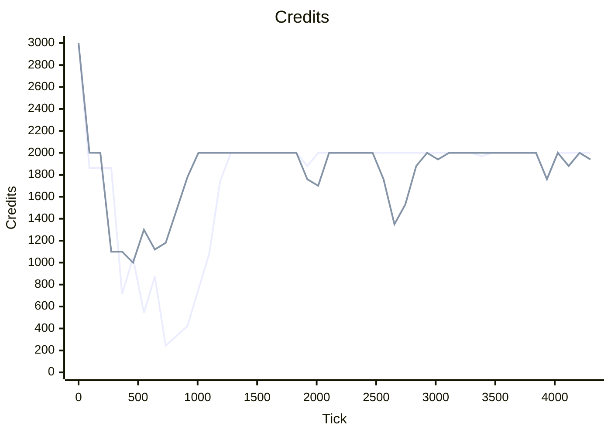
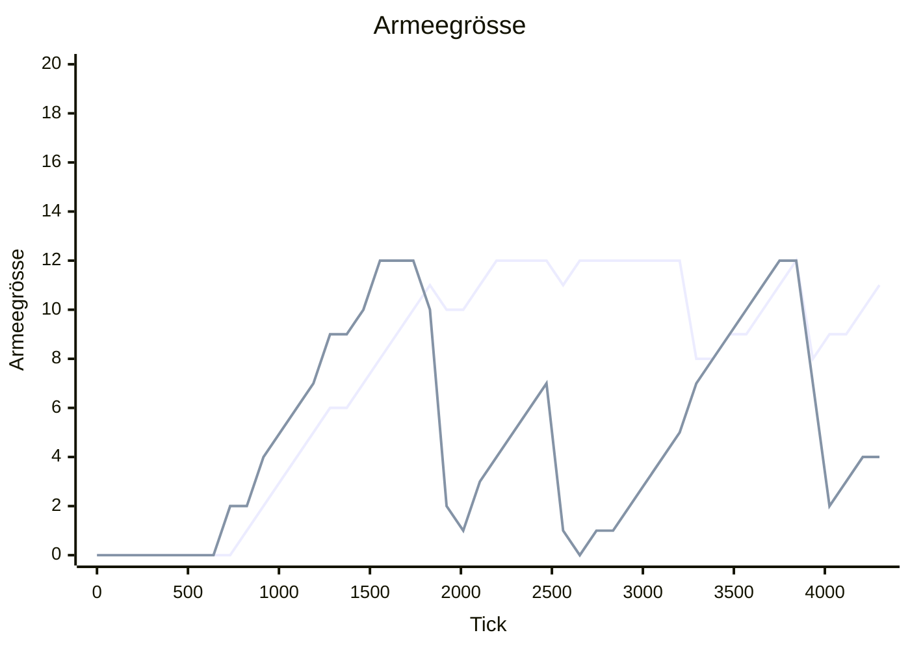
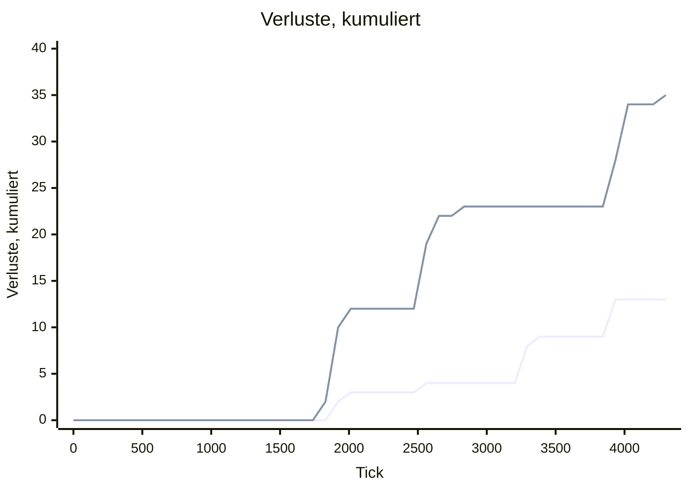
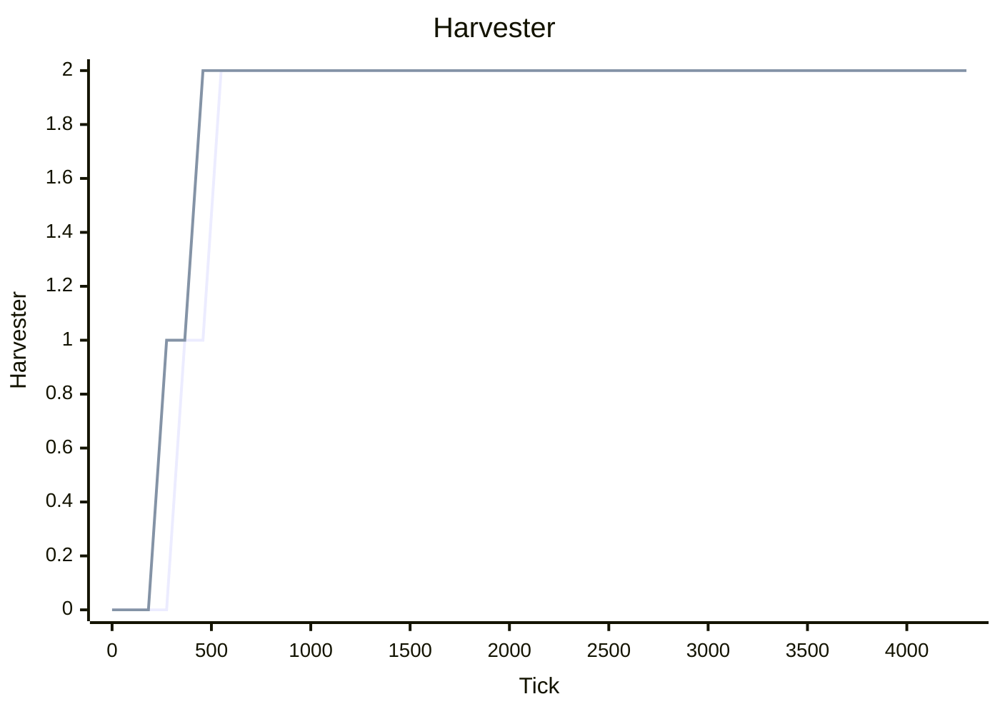

# Laborlauf 20260813-1927-6232ce1c

> [!IMPORTANT]
> **DIAGNOSE, kein Nachweis.** Nichts in diesem Bericht wurde im laufenden Spiel gesehen.
> Alle Zahlen stammen aus headless-Läufen derselben Quelldateien, die Unity lädt — das
> macht sie vergleichbar, nicht wahr. Es gibt bewusst **keine Rangfolge**: die Werte stehen
> nebeneinander, die Auswahl trifft ein Mensch.

| Herkunft | Wert |
| --- | --: |
| gemessen am | 2026-08-13T19:27:22Z |
| Commit | `6232ce1c795415762eb7f56cac1afbbfb8a29da5` |
| Definitionstabelle | `0xD5F219A3F68088FF` |
| KI-Verhalten | `r12.CA58924C` |
| Messgerät | `Schema 2` |
| Seed | `0xA17E57DE57` |
| Tickbudget | 27.000 |
| Slots | 2 |
| specVersion | 1 |
| Fingerabdruck | `be1e9f094fabc153` |

Interaktive Fassung derselben Zahlen: [`dashboard.html`](../../out/dashboard.html) — Kurven mit Fadenkreuz, Heatmap mit Abstandsdetail, Scrubber. Lokal öffnen, kein Server nötig; GitHub zeigt HTML nicht an, dafür ist dieser Bericht da.

## Laufart 1 · `match` — die Partie: KI gegen KI

Eine kanonische Partie über beide Slots, Metriken alle 50 Ticks, reine Beobachtung — ein Lauf mit und ohne Trace liefert dieselbe Hash-Kette.

| Kennzahl | Wert | Kontext |
| --- | --: | --- |
| Ausgang | VictoryElimination | Slot 0 · alliance |
| Entschieden bei Tick | 4.337 | von 27.000 Budget |
| Rechenzeit | 965 ms | 4.494 Ticks/s |
| Metrikproben | 87 | alle 50 Ticks |
| Hash-Kette | 9 | alle 500 Ticks |
| Endzustands-Hash | `0x2345EBBC2EA11405` | bei Tick 4.337 |

| Endwert je Slot | Slot 0 · alliance | Slot 1 · legion |
| --- | --: | --: |
| Credits | 2.000 | 1.940 |
| Armeegrösse | 11 | 4 |
| Verluste, kumuliert | 13 | 35 |
| Harvester | 2 | 2 |
| Gebäude | 4 | 4 |
| Sichtbare Feindeinheiten | 0 | 2 |

1. Linie **Slot 0 · alliance** · 2. Linie **Slot 1 · legion**. `xychart-beta` kennt keine Legende, deshalb steht die Zuordnung hier. x-Achse Tick 0 bis 4.300, alle Werte ganzzahlig — kein Float verlässt die Simulation.

**Credits** — Kassenstand je Slot



**Armeegrösse** — lebende Kampfeinheiten



**Verluste, kumuliert** — verlorene Einheiten seit Tick 0



**Harvester** — Erntefahrzeuge im Feld



**Verworfene Intents:** 0 von 218 (Slot 0) und 0 von 143 (Slot 1). Diese Spalte ist die unterschätzte — sie zeigt, wo die KI gegen Executor-Regeln anrennt, und ist überall sonst stumm, weil `Submit()` das Verdikt nicht auswertet.

**Der Seed ändert die Partie nicht.** Kein Simulationssystem zieht aus dem Kernel-PRNG; der Seed geht in Zustands-Hash und Snapshot, sonst nirgendwohin. Ein Sweep über 24 Seeds ist *eine* Beobachtung.

## Laufart 4 · `compare` — Kandidatenprofile gegen die eingefrorene Referenz

Jeder Kandidat spielt gegen `ms1-canonical`, in beiden Fraktionsrollen — das hebt die Spawnreihenfolge auf. Die Zeilenreihenfolge ist die Kandidatenliste, nicht die Güte.

| Kandidat | geändert gegen Referenz | Sieg % | S/N/U | Entsch. Tick | Credits | Armee | verloren | Intents | verworfen |
| --- | --- | --: | --: | --: | --: | --: | --: | --: | --: |
| **ms1-canonical** _Referenz_ | — | 50 % | 1/1/0 | 4.337 | 1.970 | 7 | 23 | 361 | 0 |
| **early-push** | armySize 12→10; squadThreshold 6→3 | 50 % | 1/1/0 | 9.946 (+129 %) | 1.880 (-5 %) | 5 (-29 %) | 68 (+196 %) | 954 | 0 |
| **late-push** | armySize 12→20; squadThreshold 6→12 | 100 % | 2/0/0 | 12.621 (+191 %) | 1.940 (-2 %) | 18 (+157 %) | 112 (+387 %) | 1.477 | 0 |
| **greedy-economy** | harvesters 2→4; armySize 12→16; squadThreshold 6→8 | 50 % | 1/1/0 | 8.019 (+85 %) | 2.000 (+2 %) | 9 (+29 %) | 60 (+161 %) | 985 | 0 |
| **power-buffer** | powerReserve 0→30 | 50 % | 1/1/0 | 7.478 (+72 %) | 2.000 (+2 %) | 9 (+29 %) | 43 (+87 %) | 729 | 0 |
| **fast-cadence** | cadence 20→10 | 50 % | 1/1/0 | 7.576 (+75 %) | 1.940 (-2 %) | 6 (-14 %) | 35 (+52 %) | 1.162 | 0 |
| **wave-off** | waveSize 12→1 | 0 % | 0/1/1 | 17.708 (+308 %) | 2.000 (+2 %) | 6 (-14 %) | 145 (+530 %) | 2.402 | 0 |
| **wave-6** | waveSize 12→6 | 50 % | 1/1/0 | 4.337 | 1.970 | 7 | 23 | 361 | 0 |
| **wave-10** | waveSize 12→10 | 50 % | 1/1/0 | 4.337 | 1.970 | 7 | 23 | 361 | 0 |
| **wave-6-far** | waveSize 12→6; staging 12→70; stagingTol 4→6 | 50 % | 1/1/0 | 7.146 (+65 %) | 2.000 (+2 %) | 7 | 55 (+139 %) | 680 | 0 |
| **retreat-off** | retreatAt 60→0% | 50 % | 1/1/0 | 4.487 (+3 %) | 2.000 (+2 %) | 7 | 27 (+17 %) | 298 | 0 |
| **retreat-40** | retreatAt 60→40% | 50 % | 1/1/0 | 3.757 (-13 %) | 2.000 (+2 %) | 7 | 19 (-17 %) | 248 | 0 |
| **retreat-75** | retreatAt 60→75% | 50 % | 1/1/0 | 9.261 (+114 %) | 1.940 (-2 %) | 8 (+14 %) | 52 (+126 %) | 990 | 0 |
| **retreat-25-near** | retreatAt 60→25%; retreatDanger 8→4 | 50 % | 1/1/0 | 3.714 (-14 %) | 2.000 (+2 %) | 7 | 19 (-17 %) | 249 | 0 |
| **army-16** | armySize 12→16 | 50 % | 1/1/0 | 7.844 (+81 %) | 2.000 (+2 %) | 9 (+29 %) | 61 (+165 %) | 877 | 0 |
| **army-18** | armySize 12→18 | 50 % | 1/1/0 | 9.110 (+110 %) | 2.000 (+2 %) | 10 (+43 %) | 75 (+226 %) | 1.126 | 0 |
| **army-20** | armySize 12→20 | 100 % | 2/0/0 | 8.488 (+96 %) | 2.000 (+2 %) | 19 (+171 %) | 61 (+165 %) | 1.028 | 0 |
| **army-24** | armySize 12→24 | 100 % | 2/0/0 | 8.786 (+103 %) | 2.000 (+2 %) | 21 (+200 %) | 68 (+196 %) | 1.213 | 0 |
| **army-36** | armySize 12→36 | 100 % | 2/0/0 | 6.613 (+52 %) | 2.000 (+2 %) | 31 (+343 %) | 38 (+65 %) | 1.099 | 0 |
| **strength-off** | waveStrength 1200→0 | 50 % | 1/1/0 | 4.337 | 1.970 | 7 | 23 | 361 | 0 |
| **defend-off** | defendHome 10→0 | 50 % | 1/1/0 | 3.809 (-12 %) | 2.000 (+2 %) | 8 (+14 %) | 17 (-26 %) | 293 | 0 |
| **defend-8** | defendHome 10→8 | 50 % | 1/1/0 | 4.337 | 1.970 | 7 | 23 | 361 | 0 |
| **defend-16** | defendHome 10→16 | 50 % | 1/1/0 | 6.378 (+47 %) | 2.000 (+2 %) | 7 | 33 (+43 %) | 657 | 0 |
| **army-24-count** | armySize 12→24; waveStrength 1200→0 | 50 % | 1/1/0 | 6.621 (+53 %) | 2.000 (+2 %) | 13 (+86 %) | 54 (+135 %) | 1.039 | 0 |
| **army-36-count** | armySize 12→36; waveStrength 1200→0 | 50 % | 1/1/0 | 7.534 (+74 %) | 2.000 (+2 %) | 12 (+71 %) | 67 (+191 %) | 1.347 | 0 |
| **army-16-count** | armySize 12→16; waveStrength 1200→0 | 50 % | 1/1/0 | 8.355 (+93 %) | 2.000 (+2 %) | 9 (+29 %) | 72 (+213 %) | 976 | 0 |
| **army-30-count** | armySize 12→30; waveStrength 1200→0 | 50 % | 1/1/0 | 7.534 (+74 %) | 2.000 (+2 %) | 12 (+71 %) | 67 (+191 %) | 1.287 | 0 |
| **army-19** | armySize 12→19 | 50 % | 1/1/0 | 9.231 (+113 %) | 1.910 (-3 %) | 9 (+29 %) | 78 (+239 %) | 1.201 | 0 |
| **army-21** | armySize 12→21 | 100 % | 2/0/0 | 9.304 (+115 %) | 2.000 (+2 %) | 20 (+186 %) | 71 (+209 %) | 1.186 | 0 |
| **army-22** | armySize 12→22 | 100 % | 2/0/0 | 12.070 (+178 %) | 2.000 (+2 %) | 20 (+186 %) | 103 (+348 %) | 1.553 | 0 |
| **army-28** | armySize 12→28 | 100 % | 2/0/0 | 5.920 (+36 %) | 1.940 (-2 %) | 24 (+243 %) | 34 (+48 %) | 848 | 0 |
| **army-30** | armySize 12→30 | 100 % | 2/0/0 | 5.983 (+38 %) | 2.000 (+2 %) | 22 (+214 %) | 36 (+57 %) | 932 | 0 |
| **army-32** | armySize 12→32 | 100 % | 2/0/0 | 6.005 (+38 %) | 2.000 (+2 %) | 27 (+286 %) | 34 (+48 %) | 967 | 0 |
| **army-34** | armySize 12→34 | 100 % | 2/0/0 | 6.101 (+41 %) | 2.000 (+2 %) | 29 (+314 %) | 33 (+43 %) | 1.033 | 0 |
| **army-40** | armySize 12→40 | 100 % | 2/0/0 | 6.650 (+53 %) | 1.940 (-2 %) | 29 (+314 %) | 41 (+78 %) | 1.164 | 0 |
| **army-48** | armySize 12→48 | 100 % | 2/0/0 | 6.650 (+53 %) | 1.940 (-2 %) | 29 (+314 %) | 41 (+78 %) | 1.213 | 0 |
| **reinforce-20** | reinforceAt 0→20% | 50 % | 1/1/0 | 4.375 (+1 %) | 1.970 | 8 (+14 %) | 23 | 353 | 0 |
| **reinforce-50** | reinforceAt 0→50% | 50 % | 1/1/0 | 6.328 (+46 %) | 1.880 (-5 %) | 6 (-14 %) | 44 (+91 %) | 544 | 0 |
| **reinforce-70** | reinforceAt 0→70% | 50 % | 1/1/0 | 6.308 (+45 %) | 1.880 (-5 %) | 5 (-29 %) | 45 (+96 %) | 529 | 0 |
| **reinforce-40** | reinforceAt 0→40% | 50 % | 1/1/0 | 4.580 (+6 %) | 2.000 (+2 %) | 6 (-14 %) | 27 (+17 %) | 361 | 0 |
| **reinforce-25** | reinforceAt 0→25% | 50 % | 1/1/0 | 5.912 (+36 %) | 1.970 | 7 | 31 (+35 %) | 546 | 0 |
| **reinforce-30** | reinforceAt 0→30% | 50 % | 1/1/0 | 4.327 (0 %) | 1.970 | 8 (+14 %) | 23 | 342 | 0 |
| **reinforce-35** | reinforceAt 0→35% | 50 % | 1/1/0 | 4.580 (+6 %) | 2.000 (+2 %) | 6 (-14 %) | 27 (+17 %) | 361 | 0 |
| **reinforce-45** | reinforceAt 0→45% | 50 % | 1/1/0 | 6.328 (+46 %) | 1.880 (-5 %) | 6 (-14 %) | 44 (+91 %) | 544 | 0 |
| **reinforce-60** | reinforceAt 0→60% | 50 % | 1/1/0 | 6.328 (+46 %) | 1.880 (-5 %) | 6 (-14 %) | 44 (+91 %) | 544 | 0 |
| **reinforce-80** | reinforceAt 0→80% | 50 % | 1/1/0 | 6.308 (+45 %) | 1.880 (-5 %) | 5 (-29 %) | 45 (+96 %) | 529 | 0 |
| **reinforce-90** | reinforceAt 0→90% | 50 % | 1/1/0 | 9.566 (+121 %) | 1.880 (-5 %) | 6 (-14 %) | 57 (+148 %) | 770 | 0 |
| **reinforce-100** | reinforceAt 0→100% | 50 % | 1/1/0 | 9.566 (+121 %) | 1.880 (-5 %) | 6 (-14 %) | 57 (+148 %) | 770 | 0 |
| **hq-short-circuit** | hqWeight 100→0 | 50 % | 1/1/0 | 5.940 (+37 %) | 1.970 | 8 (+14 %) | 31 (+35 %) | 634 | 0 |
| **hq-weight-1** | hqWeight 100→1 | 50 % | 1/1/0 | 4.170 (-4 %) | 1.970 | 8 (+14 %) | 19 (-17 %) | 304 | 0 |
| **hq-weight-25** | hqWeight 100→25 | 50 % | 1/1/0 | 4.170 (-4 %) | 1.970 | 8 (+14 %) | 19 (-17 %) | 304 | 0 |
| **hq-weight-50** | hqWeight 100→50 | 50 % | 1/1/0 | 4.170 (-4 %) | 1.970 | 8 (+14 %) | 19 (-17 %) | 304 | 0 |
| **hq-weight-75** | hqWeight 100→75 | 50 % | 1/1/0 | 3.774 (-13 %) | 1.970 | 8 (+14 %) | 19 (-17 %) | 269 | 0 |
| **hq-weight-150** | hqWeight 100→150 | 50 % | 1/1/0 | 4.996 (+15 %) | 1.970 | 8 (+14 %) | 28 (+22 %) | 404 | 0 |
| **hq-weight-200** | hqWeight 100→200 | 50 % | 1/1/0 | 5.940 (+37 %) | 1.970 | 8 (+14 %) | 31 (+35 %) | 634 | 0 |
| **hq-weight-250** | hqWeight 100→250 | 50 % | 1/1/0 | 5.940 (+37 %) | 1.970 | 8 (+14 %) | 31 (+35 %) | 634 | 0 |
| **hq-weight-500** | hqWeight 100→500 | 50 % | 1/1/0 | 5.940 (+37 %) | 1.970 | 8 (+14 %) | 31 (+35 %) | 634 | 0 |
| **hq-weight-1000** | hqWeight 100→1000 | 50 % | 1/1/0 | 5.940 (+37 %) | 1.970 | 8 (+14 %) | 31 (+35 %) | 634 | 0 |
| **hq-weight-2000** | hqWeight 100→2000 | 50 % | 1/1/0 | 5.940 (+37 %) | 1.970 | 8 (+14 %) | 31 (+35 %) | 634 | 0 |
| **hq-weight-100000** | hqWeight 100→100000 | 50 % | 1/1/0 | 5.940 (+37 %) | 1.970 | 8 (+14 %) | 31 (+35 %) | 634 | 0 |
| **standoff-off** | standoff 80→0% | 50 % | 1/1/0 | 7.212 (+66 %) | 2.000 (+2 %) | 7 | 49 (+113 %) | 531 | 0 |
| **standoff-25** | standoff 80→25% | 50 % | 1/1/0 | 8.559 (+97 %) | 2.000 (+2 %) | 7 | 61 (+165 %) | 808 | 0 |
| **standoff-40** | standoff 80→40% | 50 % | 1/1/0 | 5.580 (+29 %) | 2.000 (+2 %) | 7 | 32 (+39 %) | 481 | 0 |
| **standoff-55** | standoff 80→55% | 50 % | 1/1/0 | 8.781 (+102 %) | 1.940 (-2 %) | 7 | 51 (+122 %) | 832 | 0 |
| **standoff-65** | standoff 80→65% | 50 % | 1/1/0 | 7.574 (+75 %) | 2.000 (+2 %) | 9 (+29 %) | 51 (+122 %) | 646 | 0 |
| **standoff-70** | standoff 80→70% | 50 % | 1/1/0 | 6.126 (+41 %) | 2.000 (+2 %) | 8 (+14 %) | 37 (+61 %) | 515 | 0 |
| **standoff-90** | standoff 80→90% | 50 % | 1/1/0 | 10.824 (+150 %) | 2.000 (+2 %) | 7 | 73 (+217 %) | 1.261 | 0 |
| **standoff-100** | standoff 80→100% | 50 % | 1/1/0 | 6.966 (+61 %) | 1.940 (-2 %) | 6 (-14 %) | 44 (+91 %) | 803 | 0 |
| **standoff-120** | standoff 80→120% | 50 % | 1/1/0 | 10.310 (+138 %) | 1.970 | 6 (-14 %) | 53 (+130 %) | 2.100 | 0 |
| **army-16-standoff-off** | armySize 12→16; standoff 80→0% | 50 % | 1/1/0 | 9.626 (+122 %) | 2.000 (+2 %) | 9 (+29 %) | 82 (+257 %) | 919 | 0 |
| **army-20-standoff-off** | armySize 12→20; standoff 80→0% | 100 % | 2/0/0 | 9.645 (+122 %) | 1.940 (-2 %) | 19 (+171 %) | 74 (+222 %) | 978 | 0 |
| **army-30-standoff-off** | armySize 12→30; standoff 80→0% | 100 % | 2/0/0 | 5.979 (+38 %) | 2.000 (+2 %) | 23 (+229 %) | 37 (+61 %) | 784 | 0 |
| **army-16-hq-100** | armySize 12→16 | 50 % | 1/1/0 | 7.844 (+81 %) | 2.000 (+2 %) | 9 (+29 %) | 61 (+165 %) | 877 | 0 |
| **army-20-hq-100** | armySize 12→20 | 100 % | 2/0/0 | 8.488 (+96 %) | 2.000 (+2 %) | 19 (+171 %) | 61 (+165 %) | 1.028 | 0 |
| **army-30-hq-100** | armySize 12→30 | 100 % | 2/0/0 | 5.983 (+38 %) | 2.000 (+2 %) | 22 (+214 %) | 36 (+57 %) | 932 | 0 |
| **army-30-reinforce-30** | armySize 12→30; reinforceAt 0→30% | 100 % | 2/0/0 | 5.551 (+28 %) | 1.880 (-5 %) | 22 (+214 %) | 33 (+43 %) | 797 | 0 |
| **army-30-reinforce-40** | armySize 12→30; reinforceAt 0→40% | 100 % | 2/0/0 | 5.551 (+28 %) | 1.880 (-5 %) | 22 (+214 %) | 33 (+43 %) | 797 | 0 |
| **army-30-reinforce-50** | armySize 12→30; reinforceAt 0→50% | 100 % | 2/0/0 | 5.551 (+28 %) | 1.880 (-5 %) | 22 (+214 %) | 33 (+43 %) | 797 | 0 |
| **army-30-reinforce-60** | armySize 12→30; reinforceAt 0→60% | 100 % | 2/0/0 | 5.551 (+28 %) | 1.880 (-5 %) | 22 (+214 %) | 33 (+43 %) | 797 | 0 |
| **army-30-reinforce-70** | armySize 12→30; reinforceAt 0→70% | 100 % | 2/0/0 | 5.551 (+28 %) | 1.880 (-5 %) | 22 (+214 %) | 33 (+43 %) | 797 | 0 |
| **army-30-reinforce-80** | armySize 12→30; reinforceAt 0→80% | 100 % | 2/0/0 | 5.551 (+28 %) | 1.880 (-5 %) | 22 (+214 %) | 33 (+43 %) | 797 | 0 |

**Was hier _nicht_ steht.** Keine Spalte ist zu einer Note verrechnet und nichts ist nach Güte sortiert. Eine einzelne Zahl belohnt zuverlässig das Falsche — eine KI, die 5 % häufiger gewinnt, weil sie den Gegner mit Bauarbeitern zumüllt, ist keine bessere KI.

**1 Seed je Kandidat** — die Seed-Achse ist heute leer, also sind das 2 Partien je Kandidat, nicht 2 unabhängige Stichproben.

## Laufart 2 · `duel` — die Gegentabelle, gemessen statt abgelesen

AE-Parität statt Stückzahlparität, drei Startabstände, jede Paarung in beide Richtungen. Zeile = die zuerst gespawnte Seite. Der Wert ist ihre Bilanz über die drei Abstände (Siege − Niederlagen, Bereich −3…+3); die Abstände einzeln stehen im Dashboard.

| Zeile gewinnt ↓ / Spalte → | All.AntiArmorInfantry | All.Artillery | All.BasicInfantry | All.BattleTank | All.LightTank | All.ScoutVehicle | Leg.AntiArmorInfantry | Leg.Artillery | Leg.BasicInfantry | Leg.BattleTank | Leg.LightTank | Leg.ScoutVehicle |
| --- | --: | --: | --: | --: | --: | --: | --: | --: | --: | --: | --: | --: |
| **All.AntiArmorInfantry** | +3 | +2&nbsp;⚠ | -2 | -1 | +1 | -2 | +2 | +2&nbsp;⚠ | -2 | -1 | -1 | 0 |
| **All.Artillery** | -2&nbsp;⚠ | +2&nbsp;⚠ | -2&nbsp;⚠ | -2&nbsp;⚠ | -2&nbsp;⚠ | -2&nbsp;⚠ | -2&nbsp;⚠ | +2&nbsp;⚠ | -2&nbsp;⚠ | -2&nbsp;⚠ | -2&nbsp;⚠ | -2&nbsp;⚠ |
| **All.BasicInfantry** | +2 | +2&nbsp;⚠ | +3 | -2 | +1 | +2 | +1 | +2&nbsp;⚠ | -1 | -1 | -1 | +1 |
| **All.BattleTank** | +1 | +2&nbsp;⚠ | +2 | +2 | +2 | +2 | +1 | +2&nbsp;⚠ | +1 | -2 | +2 | +2 |
| **All.LightTank** | -1 | +2&nbsp;⚠ | -1 | -2 | +1 | +1 | -2 | +2&nbsp;⚠ | -1 | -3 | -2 | +2 |
| **All.ScoutVehicle** | +2 | +2&nbsp;⚠ | -2 | -2 | -1 | +1 | +1 | +2&nbsp;⚠ | -2 | -2 | -2 | +1 |
| **Leg.AntiArmorInfantry** | 0 | +2&nbsp;⚠ | -1 | +1 | +2 | -1 | +3 | +2&nbsp;⚠ | -2 | 0 | +2 | -1 |
| **Leg.Artillery** | -2&nbsp;⚠ | -2&nbsp;⚠ | -2&nbsp;⚠ | -2&nbsp;⚠ | -2&nbsp;⚠ | -2&nbsp;⚠ | -2&nbsp;⚠ | +2&nbsp;⚠ | -2&nbsp;⚠ | -2&nbsp;⚠ | -2&nbsp;⚠ | -2&nbsp;⚠ |
| **Leg.BasicInfantry** | +2 | +2&nbsp;⚠ | +1 | -1 | +1 | +2 | +2 | +2&nbsp;⚠ | +1 | -1 | +1 | +2 |
| **Leg.BattleTank** | +1 | +2&nbsp;⚠ | +1 | +2 | +3 | +2 | 0 | +2&nbsp;⚠ | +2 | +3 | +2 | +2 |
| **Leg.LightTank** | +1 | +2&nbsp;⚠ | +1 | -2 | +2 | +2 | -3 | +2&nbsp;⚠ | -1 | -2 | +1 | +1 |
| **Leg.ScoutVehicle** | 0 | +2&nbsp;⚠ | -1 | -2 | -2 | -2 | +1 | +2&nbsp;⚠ | -2 | -2 | -1 | +3 |

`·` — in keinem Abstand Kontakt · `⚠` — kein Kontakt in mindestens einem Abstand

| Duelle | entschieden | ins Tickbudget | ohne Kontakt | wackelnde Parität | AE-Budget je Paarung |
| --: | --: | --: | --: | --: | --: |
| 576 | 360 | 216 | 100 | 6 | 360–6.000 AE (12 Werte) |

**Das Budget gilt je Paarung, nicht für die Tabelle.** Es ist so bemessen, dass die teurere Seite die eingestellte Stückzahl aufstellt — die billigere stellt, was dieselben AE kaufen. Ein globales Budget wäre falsch: bei 10.000 AE stellte eine billige Paarung 83 Einheiten je Seite und maß damit Formation und Pathfinding, nicht die Waffe.

**100 Duelle ohne einen einzigen Schuss.** Wo die Waffenreichweite über der Sichtweite liegt, kann sie ohne Aufklärung nicht benutzt werden — `CombatSystem` verlangt das Ziel als sichtbar in der committed Team-Sicht. Das ist ein Balance-Befund, kein Messfehler.

**6 Paarungen** liessen über 10 % eines Budgets ungenutzt — dort wackelt die AE-Parität selbst, ihr Ausgang ist schwaches Material.

**5 Richtungsabweichungen** — Rollenpaarungen, bei denen A gegen B anders ausgeht als B gegen A. Sie sind so knapp, dass die Spawnreihenfolge sie kippt; das gehört in den Bericht, nicht wegkalibriert. Spiegelpaarungen (dieselbe Rolle gegen sich selbst) zählen nicht mit: dort entscheidet die dokumentierte Duell-Asymmetrie.

<details><summary>Die betroffenen Paarungen</summary>

- All.AntiArmorInfantry ↔ Leg.AntiArmorInfantry
- All.BattleTank ↔ Leg.AntiArmorInfantry
- All.ScoutVehicle ↔ Leg.ScoutVehicle
- Leg.AntiArmorInfantry ↔ Leg.LightTank
- Leg.BasicInfantry ↔ Leg.BattleTank

</details>

## Laufart 2 · Belagerungsstaffel — womit reisst man eine Basis ein

Gebäude schiessen nicht zurück — ausser der `DefensePlatform`. Gemessen wird deshalb die Zeit bis zum Abriss, gegen das eigene Fraktionsgebäude, Staffel *Berührung*. Sortierung alphabetisch, nicht nach Zeit.

> [!WARNING]
> **Diese Staffel läuft nicht auf AE-Parität**, anders als die Einheitenduelle. Jeder
> Angreifer stellt sechs Einheiten *seiner* Kosten, die Tickzahlen sind untereinander
> deshalb nicht direkt vergleichbar — die AE-Spalte gehört zur Tickspalte dazu. Wer
> Waffenwirkung vergleichen will, rechnet `Ticks × AE`.

| Angreifer | Gebäude | Ticks bis Abriss | Einheiten | AE | eigene Verluste |
| --- | --- | --: | --: | --: | --: |
| **All.AntiArmorInfantry** | All.Barracks | 52 | 6 | 1.500 | 0 |
| **All.AntiArmorInfantry** | All.DefensePlatform | 52 | 6 | 1.500 | 1 |
| **All.AntiArmorInfantry** | All.Power | 27 | 6 | 1.500 | 0 |
| **All.Artillery** | All.Barracks | 72 | 6 | 6.000 | 0 |
| **All.Artillery** | All.DefensePlatform | 72 | 6 | 6.000 | 0 |
| **All.Artillery** | All.Power | 2 | 6 | 6.000 | 0 |
| **All.BasicInfantry** | All.Barracks | 443 | 6 | 720 | 0 |
| **All.BasicInfantry** | All.DefensePlatform | 292 | 6 | 720 | 6 |
| **All.BasicInfantry** | All.Power | 290 | 6 | 720 | 0 |
| **All.BattleTank** | All.Barracks | 127 | 6 | 5.400 | 0 |
| **All.BattleTank** | All.DefensePlatform | 127 | 6 | 5.400 | 0 |
| **All.BattleTank** | All.Power | 77 | 6 | 5.400 | 0 |
| **All.LightTank** | All.Barracks | 182 | 6 | 3.600 | 0 |
| **All.LightTank** | All.DefensePlatform | 182 | 6 | 3.600 | 0 |
| **All.LightTank** | All.Power | 122 | 6 | 3.600 | 0 |
| **All.ScoutVehicle** | All.Barracks | 392 | 6 | 1.800 | 0 |
| **All.ScoutVehicle** | All.DefensePlatform | 542 | 6 | 1.800 | 3 |
| **All.ScoutVehicle** | All.Power | 262 | 6 | 1.800 | 0 |
| **Leg.AntiArmorInfantry** | Leg.Barracks | 52 | 6 | 1.200 | 0 |
| **Leg.AntiArmorInfantry** | Leg.DefensePlatform | 52 | 6 | 1.200 | 1 |
| **Leg.AntiArmorInfantry** | Leg.Power | 27 | 6 | 1.200 | 0 |
| **Leg.Artillery** | Leg.Barracks | 72 | 6 | 4.800 | 0 |
| **Leg.Artillery** | Leg.DefensePlatform | 72 | 6 | 4.800 | 0 |
| **Leg.Artillery** | Leg.Power | 72 | 6 | 4.800 | 0 |
| **Leg.BasicInfantry** | Leg.Barracks | 632 | 6 | 360 | 0 |
| **Leg.BasicInfantry** | Leg.DefensePlatform | 172 | 6 | 360 | 6 |
| **Leg.BasicInfantry** | Leg.Power | 422 | 6 | 360 | 0 |
| **Leg.BattleTank** | Leg.Barracks | 52 | 6 | 4.200 | 0 |
| **Leg.BattleTank** | Leg.DefensePlatform | 52 | 6 | 4.200 | 0 |
| **Leg.BattleTank** | Leg.Power | 27 | 6 | 4.200 | 0 |
| **Leg.LightTank** | Leg.Barracks | 242 | 6 | 2.700 | 0 |
| **Leg.LightTank** | Leg.DefensePlatform | 242 | 6 | 2.700 | 0 |
| **Leg.LightTank** | Leg.Power | 162 | 6 | 2.700 | 0 |
| **Leg.ScoutVehicle** | Leg.Barracks | 422 | 6 | 1.320 | 0 |
| **Leg.ScoutVehicle** | Leg.DefensePlatform | 712 | 6 | 1.320 | 6 |
| **Leg.ScoutVehicle** | Leg.Power | 282 | 6 | 1.320 | 0 |

**Nur 16 von 72 Belagerungen auf Waffenreichweite wurden entschieden**, gegen 72 von 72 auf Berührung. Dieselbe Ursache wie in der Gegentabelle: ohne Sicht kein Feuer.

## Laufart 3 · `movement` — Bewegung: vier Szenarien

Hindernisse sind Daten, nicht Code: eine Fussabdruckliste, eine Gruppe, ein Befehl.

**Überlauf im Szenario `standoff`** — Zellen, die Fernkämpfer mit Angriffsbefehl über die Entfernung hinaus vorrücken, auf der sie zum ersten Mal Schaden angerichtet haben.

| Fraktion / Rolle | Überlauf (nutzbar) | Reichweite | Sicht | Feuer ab | nächster Abstand | angekommen |
| --- | --: | --: | --: | --: | --: | --: |
| Alliance Artillery | 7 von 7 | 20 | 10 | 7 | 0 | 0/8 |
| Legion Artillery | 7 von 7 | 18 | 10 | 7 | 0 | 0/8 |

**Nur die erste Spalte ist Issue 03.** Der Abstand zwischen nominaler Reichweite und „Feuer ab" gehört der Aufklärung, nicht der Bewegung: `CombatSystem` verlangt das Ziel als sichtbar in der committed Team-Sicht. Ein Kontrolllauf, der die Gruppe auf voller Reichweite stehen liess, richtete über 2.000 Ticks null Schaden an — „auf Reichweite stehenbleiben" wäre also keine Verbesserung, sondern eine wirkungslose Waffe. Die Werte sind absichtlich fraktionsasymmetrisch (Allianz 20, Legion 18 Tiles). Im `standoff` ist „angekommen 0" kein Befund, sondern der Auftrag: die Gruppe greift an, sie reist nicht.

**Alle Szenarien, gemessene Rohwerte je Fraktion**

| Szenario | Fraktion | Rolle | Gruppe | angekommen | erster/letzter | Streuung | Weg | Luftlinie | blockiert | Durchlass | Überlauf (nutzbar) |
| --- | --- | --- | --: | --: | --: | --: | --: | --: | --- | --- | --: |
| Arrival | Alliance | BasicInfantry | 8 | 8 | 274/280 | 3 | 130 | — | — | — | — |
| Arrival | Legion | BasicInfantry | 8 | 8 | 274/280 | 3 | 130 | — | — | — | — |
| Blocking | Alliance | BasicInfantry | 16 | 14 | 163/185 | 4 | — | — | 0 Einh. · 0 Ticks | 2 Zellen @ y=63 | — |
| Blocking | Legion | BasicInfantry | 16 | 15 | 162/185 | 4 | — | — | 0 Einh. · 0 Ticks | 2 Zellen @ y=63 | — |
| Standoff | Alliance | Artillery | 8 | 0 | — | 0 | — | — | — | — | 7 |
| Standoff | Legion | Artillery | 8 | 0 | — | 0 | — | — | — | — | 7 |
| Detour | Alliance | BasicInfantry | 8 | 8 | 429/451 | 3 | 199 | 50 | — | 5 Zellen @ y=18 | — |
| Detour | Legion | BasicInfantry | 8 | 8 | 429/452 | 3 | 201 | 50 | — | 5 Zellen @ y=18 | — |

## Reproduktion

Alle Zahlen dieses Berichts stammen aus vier Kommandos und einem Berichtslauf:

```bash
export DOTNET_ROOT="$PWD/.dotnet"; export PATH="$DOTNET_ROOT:$PATH"
dotnet run --project Nova.AiLab -c Release -- match --trace-every 50 --hash-every 500 --view-every 25 --fog --out out/match
dotnet run --project Nova.AiLab -c Release -- duel     --out out/duel
dotnet run --project Nova.AiLab -c Release -- movement --out out/movement
dotnet run --project Nova.AiLab -c Release -- compare  --out out/compare
python3 Nova.AiLab/report/build_reports.py out
```

---

Nova.AiLab ist lokales Werkzeug, kein Beitrag — es gerät in keinen `feat/`-Branch und wird nie gemergt. Diese Ergebnismenge ist an Commit `6232ce1c` und Definitionstabelle `0xD5F219A3F68088FF` gebunden. Nach dem nächsten Merge-Fenster des Maintainers sind die Zahlen nicht mehr vergleichbar und werden neu vermessen, nicht über die Grenze hinweg verglichen.

*DIAGNOSIS — never proof. No scalar score, no ranking: the numbers sit side by side and a human picks.*
